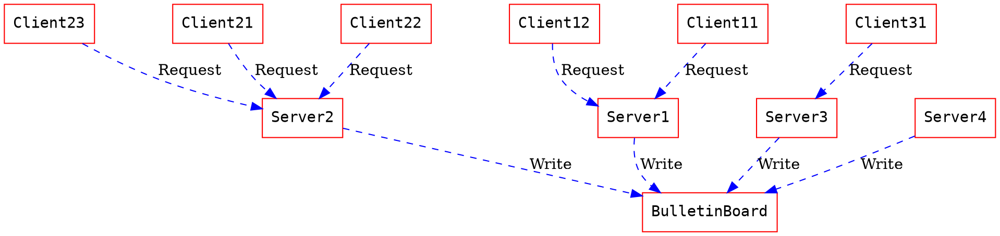

## 1. Problem Description

In 2050, urban landscapes worldwide have transformed into high-tech smart schools. Every student in this campus has smart devices to interact in real-time with various services and information streams provided by the school. 

The school authorities would like to implement a system to facilitate better communication between students. To help the school, you are expected to implement a simplified multi-service bulletin board system: **csieBulletinBoard**.

There are some requests for csieBulletinBoard.

1. After a new client connects, the server **must** send current announcements automatically.
2. The bulletin board can have a maximum of `RECORD_NUM` announcements at a time. When there is only one server and the 11th announcement appears, it should directly overwrite the content of the 1st announcement, and so on.
3. A bulletin board server can support a maximum of `MAX_CLIENTS` clients connected simultaneously.
4. This bulletin board system can support a maximum of `5` servers simultaneously.




You are expected to complete the following tasks:

1. Implement the `server.c`/`client.c`. You can build them from scratch or from template we provided(but feel free to edit any part of code).
2. Modify the code in order that the `server` **will not be blocked** by any single request, but can deal with many requests simultaneously.
   ( Hint: implement multiplexing with `select()` or `poll()` and refrain from **busy waiting**. )
3. Handle every request is correctly.
   ( Hint: Use lock to avoid simultaneously writing same file.)

## 2. Compile & Run

The provided sample code can be compiled into sample server.

Feel free to modify any part of the code as you need, or implement your own server from scratch.

### Compile

You should write your own `Makefile` to compile your code.
Your `Makefile` may contain commands to generate `server` and `client`.

```Makefile
all:
    ## TODO：
    ## compile server.c and client.c to generate "server" and "client"
```

Also, your `Makefile` should be able to perform cleanup after the execution correctly (i.e, delete `server` and `client`).

```Makefile
clean:
    ## TODO：
    ## delete server and client
```

### Run

After you compile the code, you can connect to a running server and client with following command:

```bash
$ ./server {port}
```

```bash
$ ./client {ip} {port}
```

- There are at most `MAX_CLIENTS` clients connecting to server in the same time.


## 3. About the Record file

The servers will access the file `BulletinBoard`. The file contains up to `RECORD_NUM` records. There is a `BulletinBoard` file in your repository for testing your code. TAs will use file at `RECORD_PATH` while judging your homework, make sure your code does not depend on a fixed `BulletinBoard` file.

Following is the structure of a record defined in `hw1.h`:

```c
#define MAX_CLIENTS 20
#define FROM_LEN 5
#define CONTENT_LEN 20
#define RECORD_NUM 10
#define RECORD_PATH "./BulletinBoard"
typedef struct {
 char From[FROM_LEN];
 char Content[CONTENT_LEN];
} record;
```

Note that TA may use **another** header file during the test.

A record is considered empty and not a post if both of its attributes, `From` and `Content`, are empty string `""`.

- All `<user_input>` will contain only  `[a-zA-Z0-9_,.]`
- $0<{len(From)}<\texttt{FROM_LEN}$, $0<{len(Content)}<\texttt{CONTENT_LEN}$


## 4. Sample input and output

- All commands will input via `stdin` and only contents output to `stdout` will be graded.

### Server

#### Post

When client send a post request, server need to find the first unlocked record after `last` record in `BulletinBoard` and locked it immediately.

* `last` means the index of previous writing record on this server.
* `last` should be 0 if there is no previous post on this server.

After finishing the post, server should unlock the record and print following message:

```
[Log] Receive post from <FROM>
```

#### Pull

Server has to print a warning in following format if there's at least one locked post when server accepts a new connection or get a `pull` request.

```
[Warning] Try to access locked post - <number_of_locked_post>
```

Your server should respond to a `pull` request from client in **0.2s**, or you will fail to pass the testcase. 

### Client

Support 3 commands, `post`, `pull` and `exit`. All input are case sensitive and should end with `\n`(**LF not [CRLF](https://en.wikipedia.org/wiki/Newline)**).

The terminal should show following content once it connect to server.

```
==============================
Welcome to CSIE Bulletin board
==============================
FROM: TA
CONTENT:
All unlocked posts in BulletinBoard should be shown in this format ^-^
FROM: TA
CONTENT:
If the post is locked, you should skip it.
FROM: TA
CONTENT:
GLHF
==============================
```

Client process needs to print following message in a new line and wait for user's input after showing above content and each `post/pull` command.

```
Please enter your command (post/pull/exit): <user_input>
```

#### Post

Client need to send a post request to check if there is a unlocked post. If all ten posts in `BulletinBoard` are locked, **client** should print following error message and wait for next command. Note that client can only check if there is a unlocked post through server.

```
[Error] Maximum posting limit exceeded
```

If there is an writable post, wait for user's input at each `<user_input>` in following format and then send to server.

```
FROM: <user_input>
CONTENT:
<user_input>
```

#### Pull

Collect all unlocked posts from server and print in following format. If all `RECORD_NUM` posts are locked, still need to print two separated lines .

```
==============================
FROM: TA
CONTENT:
Print all unlocked posts here.
FROM: TA
CONTENT:
There should not be any extra spaces or lines.
==============================
```

#### Exit

End the client process.

## 5. Report

### Questions

1. What is busy waiting? How do you avoid busy waiting in this assignment? Is it possible to have busy waiting even with `select()`/`poll()` ?
2. What is starvation? Is it possible for a request to encounter starvation in this assignment? Please explain.
3. How do you handle a file's consistency when multiple requests within a process access to it simultaneously?
4. How do you handle a file's consistency when different process access to it simultaneously?

## 6. Grading

1. Handle valid requests on 1 server, while the server will only have 1 connection simultaneously.
   * Only Post command **(0.2 point)**
   * Only Pull command **(0.2 point)**
   * Multiple commands **(0.6 point)**
2. Handle valid requests on 1 server, while there will be multiple connections simultaneously. **(1 point)**
3. Handle valid requests on multiple servers (at most 5 servers), while each server will have only 1 connection simultaneously and different servers may access `BulletinBoard` simultaneously. **(1.5 point)**
4. Handle valid requests on multiple servers (at most 5 servers), while each server will have multiple connections simultaneously and different servers may access `BulletinBoard` simultaneously. **(1.5 point)**
5. Modify `hw1.h` and test with same testcases. The length of input will not exceed this limit. **(2 point)**

```c
#define FROM_LEN 500
#define CONTENT_LEN 2000
```

6. Report **(1 point)**
   * Please answer the problems on Homework section of NTU COOL

$Final\ score = max(0, Raw\ score-punishment)$

### Warning

* Please **strictly follow the output format** above, or you will lose the point of each task, respectively.
* Make sure your `Makefile` compile files correctly on workstation(ws1-ws5), or your score will be **0**.
* You **should not** use `fork()` or threading in this assignment, or your score will be **0**.
* Make sure your `Makefile` can clean unnecessary files with `make clean`, or you will lose **0.25 point** as a punishment.
* Make sure your server can avoid busy waiting problem, or you will lose **1 point** as a punishment.

**Deadline: 10/15 23:59** (This deadline needs to be met for full credit)
**Hard Deadline: 10/22 23:59** (This is the last date we would accept your submission for partial credit)

## 7. Submission

### To Github

The folder structure on github classroom should be

```
├- samplejudge.py
├- sampletestcases
├- client.c
├- hw1.h
├- server.c
└- Makefile
```

You can submit other .c, .h files, as long as they can be compiled to two executable files named `server` and `client` with `Makefile`.

- **Do not** submit files generated by `Makefile`. You should `make clean` before you submit. You will lose **0.25 point** as a punishment if you submit those files.

### To NTU COOL

Your **report** should be submitted to NTU COOL before deadline.
